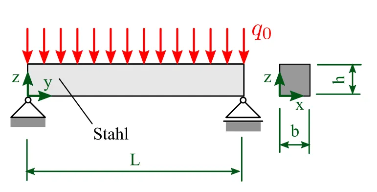

# zweiseitig gelagerter Balken

Als einfaches Beispiel starten wir mit einem zweiseitig gelagerten Balken mit Linienlast. Dieser ist in der Geometrie leicht zu erstellen und wir können die Lösungen leicht mit analytischen Gleichungen überprüfen.

<figure style="text-align:center;">
    
</figure>

## Material

Stahl

- Elastizitätsmodul $E=200 \mathrm{GPa}$
- Querkontraktionszahl $\nu=0,3$

## Geometrie

Balken mit rechteckigem Querschnitt

- Länge $L=1000 \mathrm{~mm}$
- Breite $b=30 \mathrm{~mm}$
- Breite $h=30 \mathrm{~mm}$

## Vernetzung

- Netzgröße global: 15 mm

## Randbedingungen (Lagerung und Belastung)

- Loslager auf der linken Seite
- Festlager auf der rechten Seite
- Flächenlast $q_0=1000 \mathrm{~N}$

## Gesucht

1. Die maximale Durchbiegung $u_{\max }$
2. Die maximale Spannung in y-Richtung $\sigma_{y, \max }$
