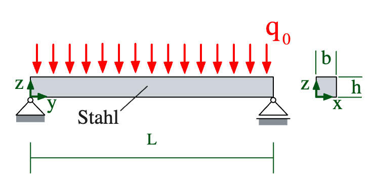
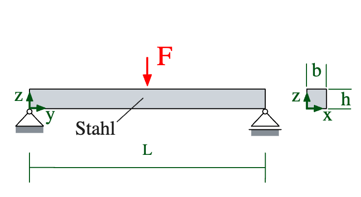
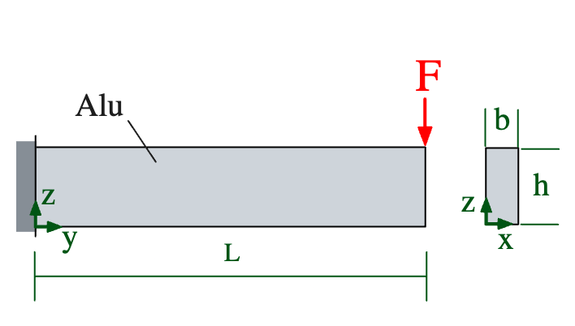
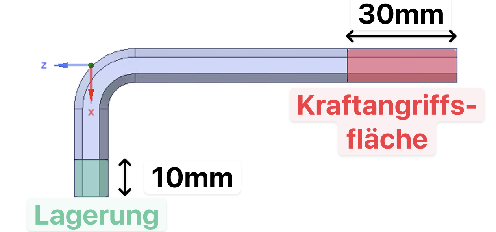
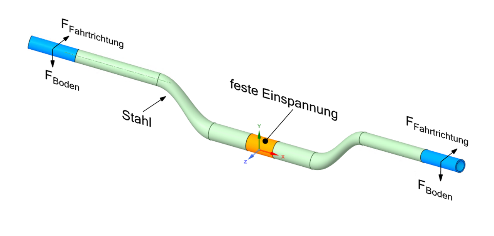

# Einführung in ANSYS Workbench

!!! abstract "Lernziele"

    - [ ] Workflow zum Lösen von strukturmechanischen Problemstellungen mit ANSYS Workbench (Mechanical) lernen und wiederholen (`Lösungsbeispiel`)
    - [ ] Erstellung und Bearbeitung einfacher Geometrien in SpaceClaim (Geometrie Tool von ANSYS) (`Übung 1+2+3+4`)
    - [ ] Was sind Singularitäten und wie geht man damit um (`Übung 2+3+4`)

## Inhalte

  <a class="prakt-card" href="01_Grundlagen/Grundprinzipien-FEM/">
    
    
      Grundprinzipien der Finiten-Elemente-Methode
    
  </a>
  <a class="prakt-card" href="01_Grundlagen/Simulationssoftware/">
    
    
      Simulationssoftware
    
  </a>
  <a class="prakt-card" href="02_Loesungsbeispiele/zweiseitig-gelagerter-balken/Aufgabenstellung/">
    
    
      Lösungsbeispiel
    
  </a>
  <a class="prakt-card" href="03_Selbsttests/Uebung-1/">
    
    
      Übung 1
      zweiseitig gelagerter Balken mit Einzelkraft
    
  </a>
  <a class="prakt-card" href="03_Selbsttests/Uebung-2/">
    
    
      Übung 2
      Kragarm mit Einzelkraft
    
  </a>
  <a class="prakt-card" href="03_Selbsttests/Uebung-3/">
    
    
      Übung 3
      Inbus Schlüssel
    
  </a>
  <a class="prakt-card" href="03_Selbsttests/Uebung-4/">
    
    
      Übung 4
      Lenker
    
  </a>

