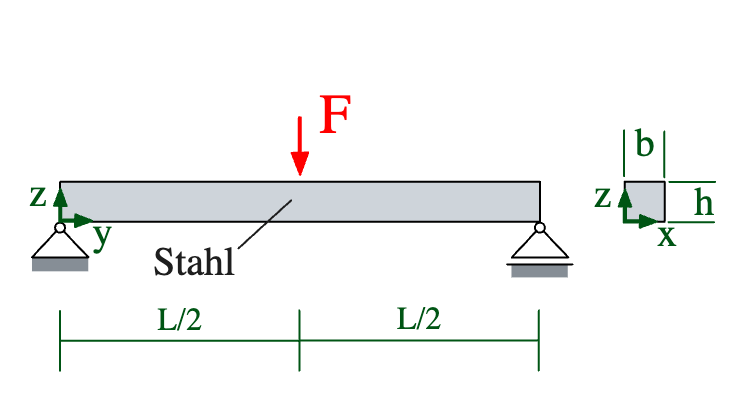
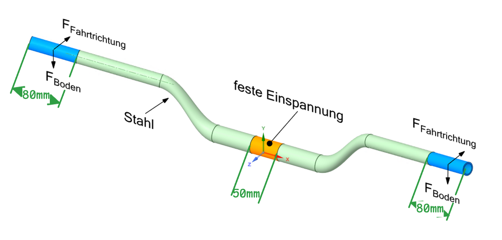

# Einführung in ANSYS Workbench

### :material-bullseye-arrow: Lernziele

- [ ] Workflow zum Lösen von strukturmechanischen Problemstellungen mit ANSYS Workbench (Mechanical) lernen und wiederholen (`Lösungsbeispiel`)
- [ ] Erstellung und Bearbeitung einfacher Geometrien in SpaceClaim (Geometrie Tool von ANSYS) (`Übung 1+2+3`)
- [ ] Was sind Singularitäten und wie geht man damit um (`Übung 2+3+4`)

### :material-table-of-contents: Inhalte

-   <a class="card-link" href="01_Grundlagen/Grundprinzipien-FEM/">
        :material-atom: __Grundprinzipien der Finiten-Elemente-Methode__{ .xxxl .middle .center }
        <figure style="text-align:center;">
          
        </figure>
    </a>
-   <a class="card-link" href="01_Grundlagen/Simulationssoftware/">
        :material-alpha-a-box: __Simulationssoftware__{ .xxxl .middle .center }
        <figure style="text-align:center;">
          
        </figure>
    </a>

-   <a class="card-link" href="02_Loesungsbeispiele/zweiseitig-gelagerter-balken/Aufgabenstellung/">
        :material-checkbox-marked-outline: __Lösungsbeispiel__{ .xxxl .middle .center }
        <figure style="text-align:center;">
          
        </figure>
    </a>

-   <a class="card-link" href="03_Selbsttests/Uebung-1/">
        :material-star: __Übung 1__{ .xxxl .middle .center }
        <figure style="text-align:center;">
          
        </figure>
    </a>

-   <a class="card-link" href="03_Selbsttests/Uebung-2/">
        :material-star: __Übung 2__{ .xxxl .middle .center }
        <figure style="text-align:center;">
          
        </figure>
    </a>

-   <a class="card-link" href="03_Selbsttests/Uebung-3/">
        :material-star: __Übung 3__{ .xxxl .middle .center }
        <figure style="text-align:center;">
          
        </figure>
    </a>

-   <a class="card-link" href="03_Selbsttests/Uebung-4/">
        :material-star: __Übung 4__{ .xxxl .middle .center }
        <figure style="text-align:center;">
          
        </figure>
    </a>

