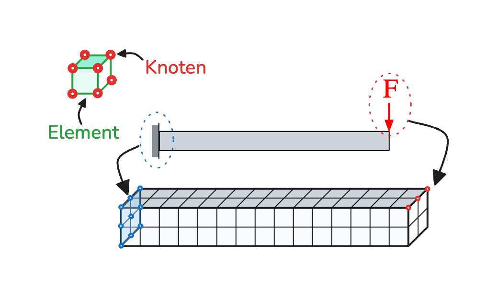

# Einführung in ANSYS Workbench

### :material-bullseye-arrow: Lernziele

- [ ] Grundlegendes Verständnis über das Grundprinzip Finite-Elemente Methode (FEM)
- [ ] Kennenlernen von Abläufen im Simulationsprogramm (ANSYS Workbench) zum Lösen von strukturmechanischen Problemstellungen

### :material-table-of-contents: Inhalte

-   <a class="card-link" href="01_Grundlagen/Grundprinzipien-FEM/">
        :material-atom: __Grundprinzipien der Finiten-Elemente-Methode__{ .xxxl .middle .center }
        <figure style="text-align:center;">
          
        </figure>
    </a>
-   <a class="card-link" href="01_Grundlagen/Simulationssoftware/">
        :material-alpha-a-box: __Simulationssoftware__{ .xxxl .middle .center }
        <figure style="text-align:center;">
          
        </figure>
    </a>

-   <a class="card-link" href="02_Loesungsbeispiele/zweiseitig-gelagerter-balken/Aufgabenstellung/">
        :material-checkbox-marked-outline: __Lösungsbeispiel__{ .xxxl .middle .center }
        <figure style="text-align:center;">
          
        </figure>
    </a>

