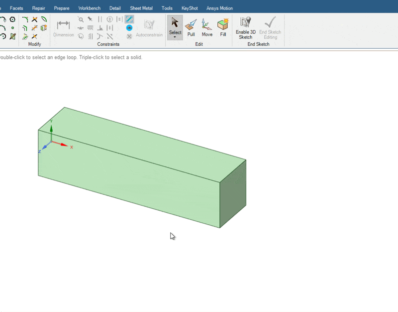
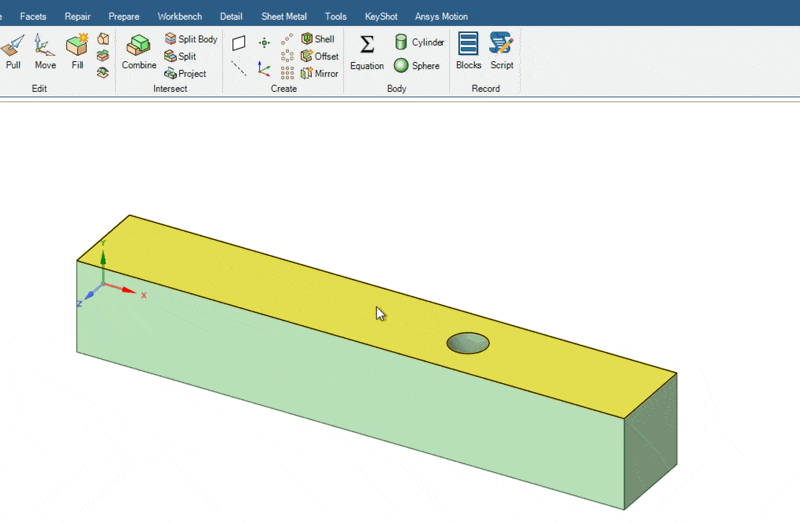
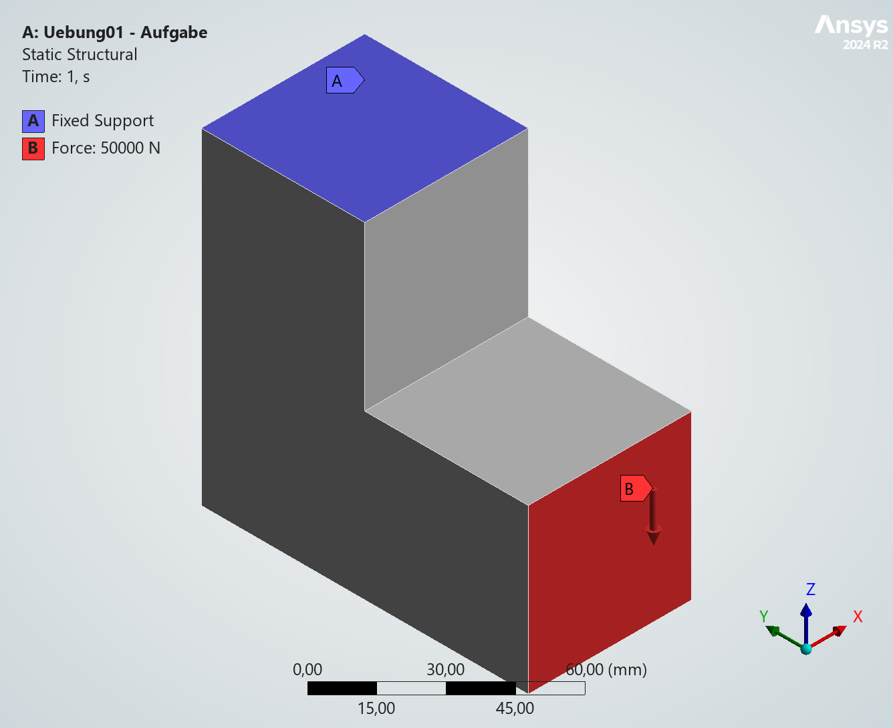
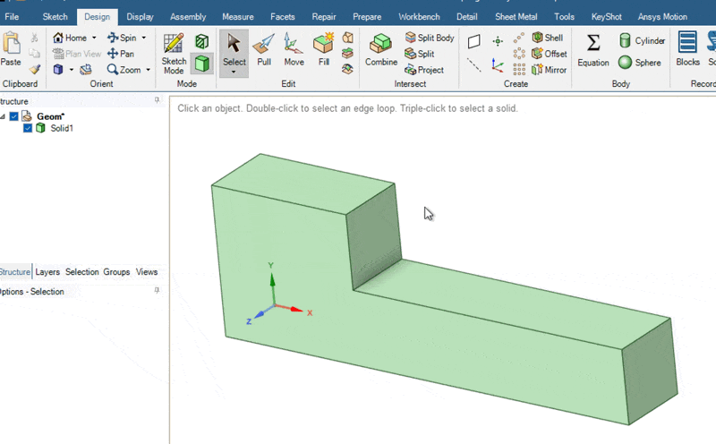
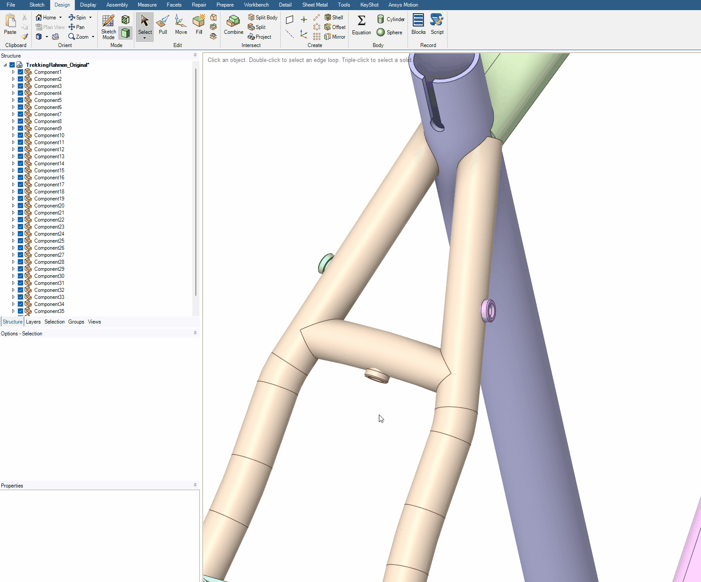
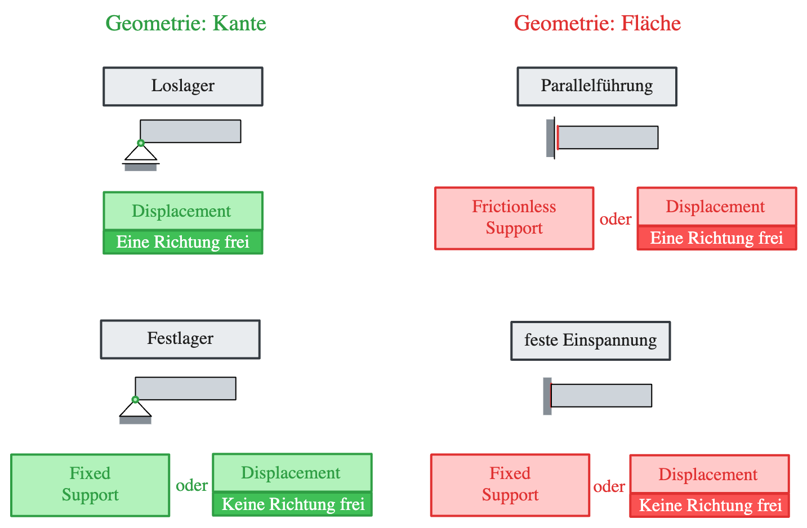
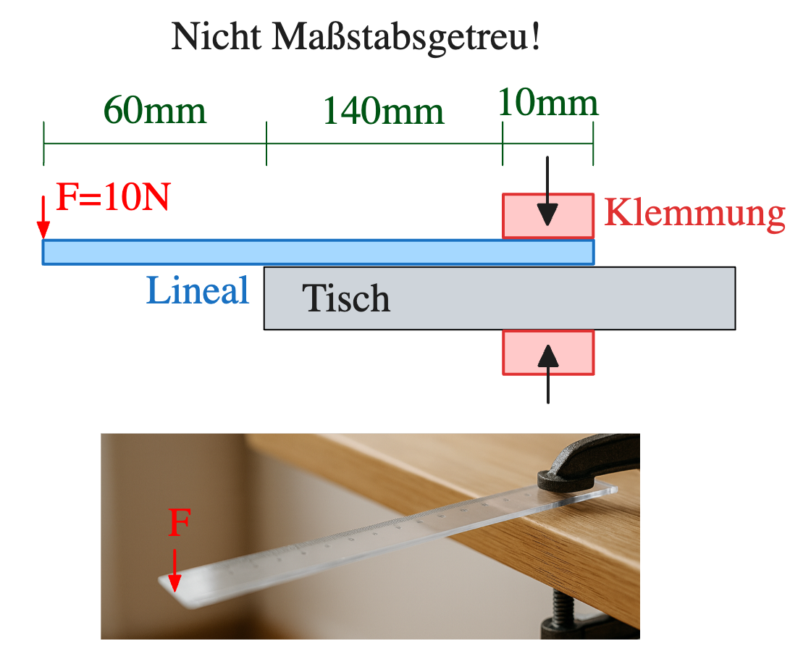

# Geometrieaufbereitung und Randbedingungen

### :material-bullseye-arrow: LERNZIELE

- [ ] Kennenlernen der grundlegenden Methoden zur Veränderung und Vereinfachung von CAD Geometrien mit SpaceClaim 
- [ ] Kennenlernen der möglichen Lagerungs- und Belastungsmethoden in ANSYS Mechanical

### :material-table-of-contents: GEOMETRIEANPASSUNGEN

-   <a class="card-link" href="01_Geometrie_anpassen/Move/">:material-cube-scan: __Längen & Positionen ändern__{ .xxxl .middle .center }
       <figure style="text-align:center;">
          
      </figure>
    </a>

-   <a class="card-link" href="01_Geometrie_anpassen/Pull/">:material-diameter-variant: __Radius ändern__{ .xxxl .middle .center }
       <figure style="text-align:center;">
          
      </figure>
    </a>

-   <a class="card-link" href="01_Geometrie_anpassen/Uebung-1/">:material-star: __Übung 1__{ .xxxl .middle .center }
       <figure style="text-align:center;">
          
      </figure>
    </a>

-   <a class="card-link" href="01_Geometrie_anpassen/Split/">:material-arrow-split-vertical: __Flächen teilen für Randbedingungen__{ .xxxl .middle .center }
       <figure style="text-align:center;">
          
      </figure>
    </a>

-   <a class="card-link" href="01_Geometrie_anpassen/SplitBody/">:material-rhombus-split: __Körper teilen__{ .xxxl .middle .center }
       <figure style="text-align:center;">
          
      </figure>
    </a>

-   <a class="card-link" href="01_Geometrie_anpassen/Blend/">:material-arrow-expand-horizontal: __Übergänge erstellen__{ .xxxl .middle .center }
       <figure style="text-align:center;">
          
      </figure>
    </a>

-   <a class="card-link" href="01_Geometrie_anpassen/Uebung-2/">:material-star: __Übung 2__{ .xxxl .middle .center }
       <figure style="text-align:center;">
      
       </figure>
    </a>

-   <a class="card-link" href="01_Geometrie_anpassen/Vereinfachungen/">:material-close-circle: __Vereinfachungen__{ .xxxl .middle .center }
       <figure style="text-align:center;">
          
      </figure>
    </a>
    
-   <a class="card-link" href="01_Geometrie_anpassen/Combine/">:material-plus-circle: __Körper zusammenfügen__{ .xxxl .middle .center }
       <figure style="text-align:center;">
          
      </figure>
    </a>

### :material-table-of-contents: LAGERUNGEN

-   <a class="card-link" href="02_Lagerungen/Einfuehrung/">:material-information-variant-box: __Einführung__{ .xxxl .middle .center }
       <figure style="text-align:center;">
          
      </figure>
    </a>

-   <a class="card-link" href="02_Lagerungen/Displacement/">:material-triangle: __Lager__{ .xxxl .middle .center }
       <figure style="text-align:center;">
          
      </figure>
    </a>

-   <a class="card-link" href="02_Lagerungen/Uebung-3/">:material-star: __Übung 3__{ .xxxl .middle .center }
       <figure style="text-align:center;">
          
      </figure>
    </a>

