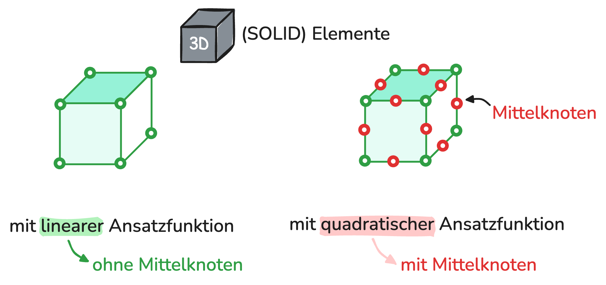
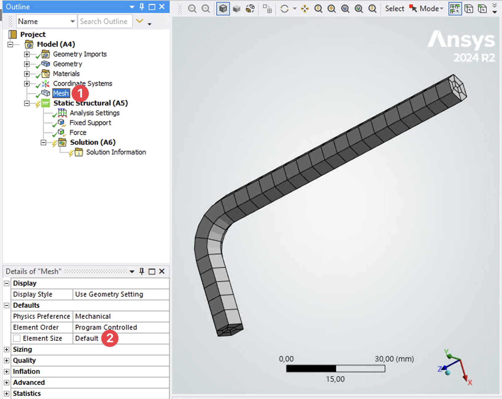
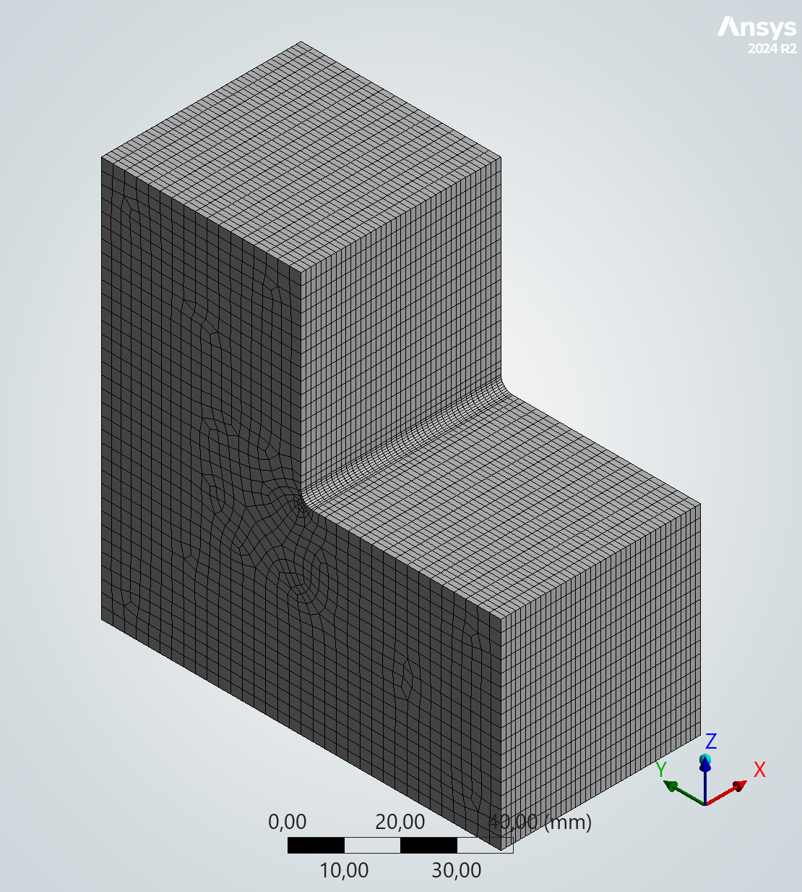
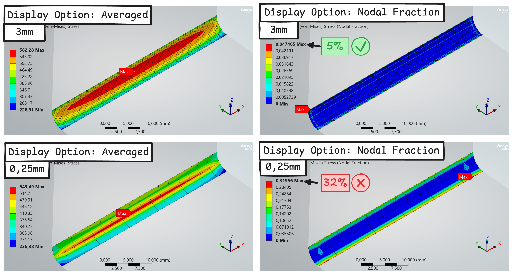
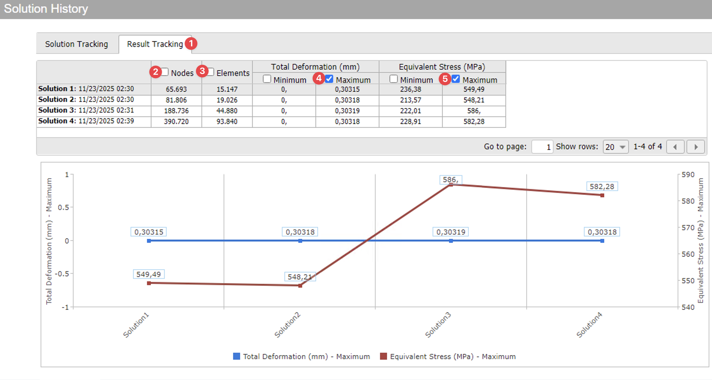
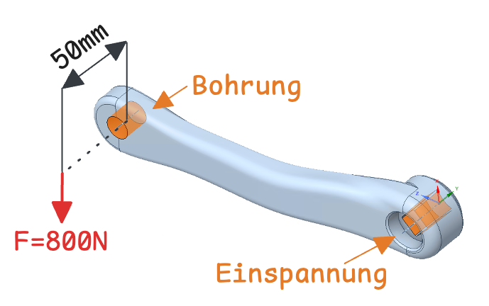
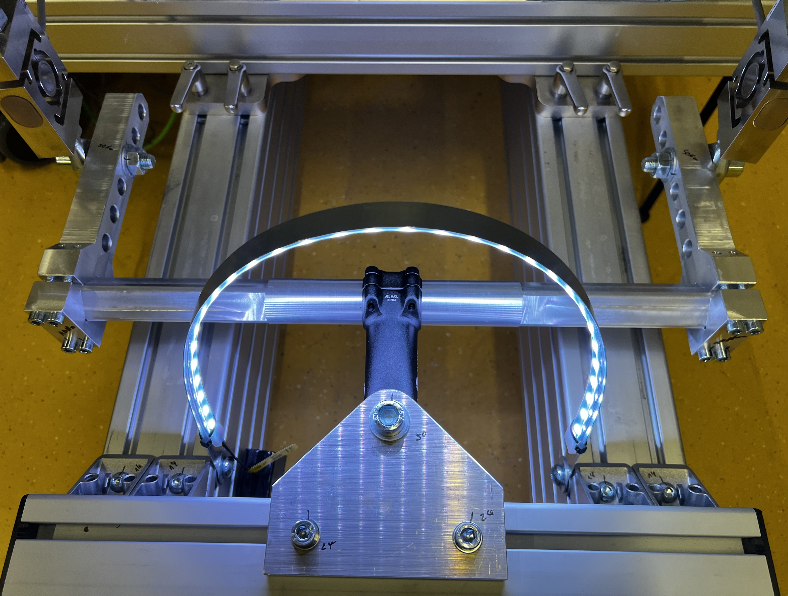
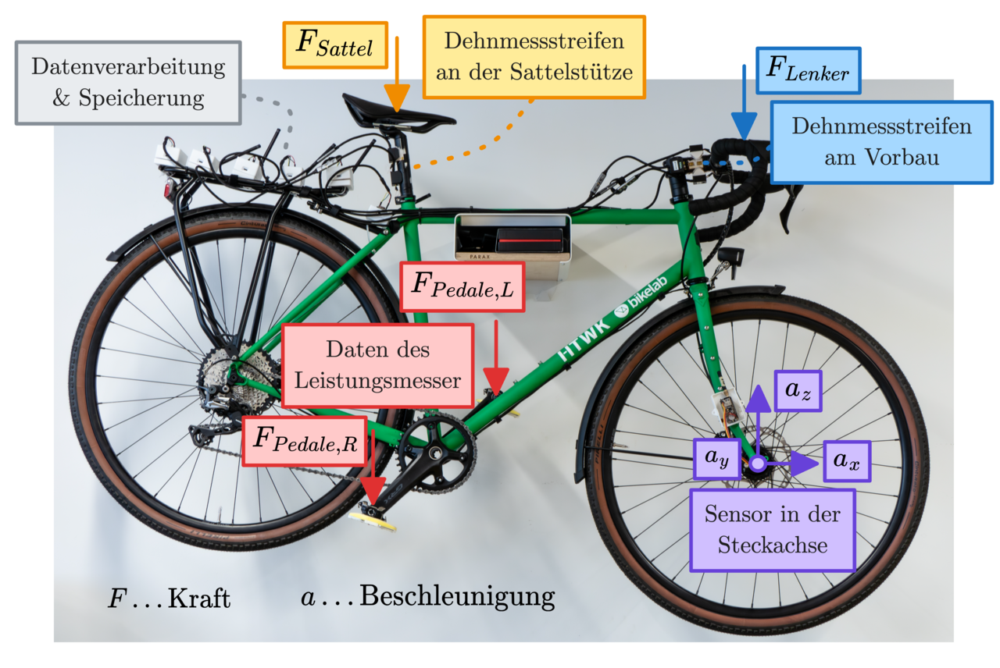

# :material-cube-unfolded: Vernetzung

!!! abstract "Lernziele"

    - [ ] Wie bestimmte ich die richtige Netzgröße?
    - [ ] Wie gehe ich mit Singularitäten um? (Spannung steigt bei stetiger Netzverfeinerung ins unendliche)

## Grundlagen

  <a class="prakt-row" href="01_Grundlagen/Elementtypen/">
    
      Elementtypen
    
    
    →
  </a>
  <a class="prakt-row" href="01_Grundlagen/Sensitivitaetsanalyse/">
    
      Sensitivitätsanalyse
    
    
    →
  </a>

## Umsetzung in ANSYS

  <a class="prakt-row" href="02_ANSYS_Umsetzung/Globale_Netzverfeinerung/">
    
      Globale Netzverfeinerung
    
    
    →
  </a>
  <a class="prakt-row" href="02_ANSYS_Umsetzung/Lokale_Netzverfeinerung/">
    
      Lokale Netzverfeinerung
    
    
    →
  </a>
  <a class="prakt-row" href="02_ANSYS_Umsetzung/Diskussion/">
    
      Diskussion
    
    
    →
  </a>
  <a class="prakt-row" href="02_ANSYS_Umsetzung/Ergebnis_Tracking/">
    
      Ergebnis Tracking
    
    
    →
  </a>
  <a class="prakt-row" href="02_ANSYS_Umsetzung/Uebung-3/">
    
      Übung 3
      Kurbelarm
    
    
    →
  </a>
  <a class="prakt-row" href="02_ANSYS_Umsetzung/Uebung-4/">
    
      Übung 4
      Vorbau
    
    
    →
  </a>
  <a class="prakt-row" href="02_ANSYS_Umsetzung/Uebung-5/">
    
      Übung 5
      bikelab ROTOR Rahmen
    
    
    →
  </a>

