# :material-video-2d: Abstraktionen

Um Rechenzeit zu sparen, sollte immer versucht werden, das Modell so weit wie möglich zu vereinfachen. Dabei gibt es drei typische Schritte:

1. Welcher Teil des Systems muss wirklich modelliert werden?
2. Welche Symmetrien kann ich ausnutzen?
3. Kann ich das Modell durch Reduzierung einer Dimension abstrahieren?

!!! abstract "Lernziele"

    - [ ] Möglichkeiten kennenlernen, Simulationsmodelle so aufzubauen, dass sie deutlich Rechenzeit sparen

## Symmetrien

  <a class="prakt-card" href="01_Symmetrie/Symmetrie/">
    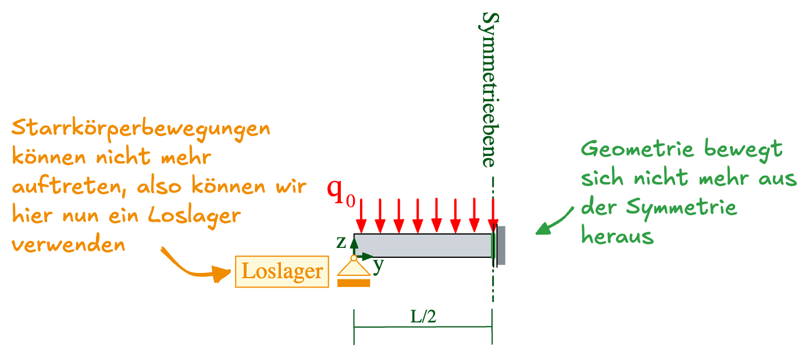
    
      Symmetrie
    
  </a>
  <a class="prakt-card" href="01_Symmetrie/Umsetzung/">
    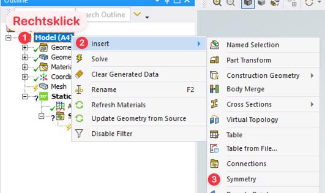
    
      Umsetzung
    
  </a>
  <a class="prakt-card" href="01_Symmetrie/Uebung01/">
    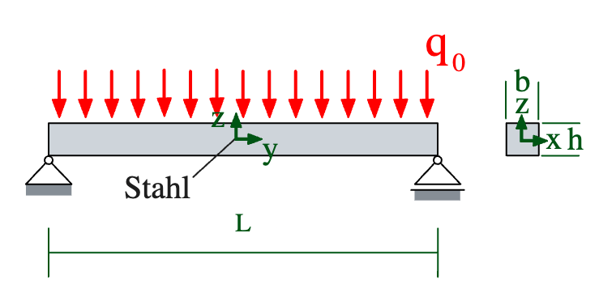
    
      Übung 1
      Zweiseitig gelagerter Balken mit Flächenlast
    
  </a>
  <a class="prakt-card" href="01_Symmetrie/Uebung02/">
    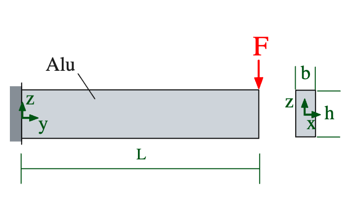
    
      Übung 2
      Kragarm mit Einzelkraft
    
  </a>

## 2D — Ebener Spannungszustand (Plane Stress)

  <a class="prakt-card" href="02_ESZ/EbenerSpannungszustand/">
    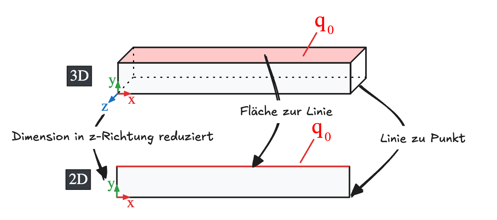
    
      2D Ebener Spannungszustand
    
  </a>
  <a class="prakt-card" href="02_ESZ/Umsetzung/">
    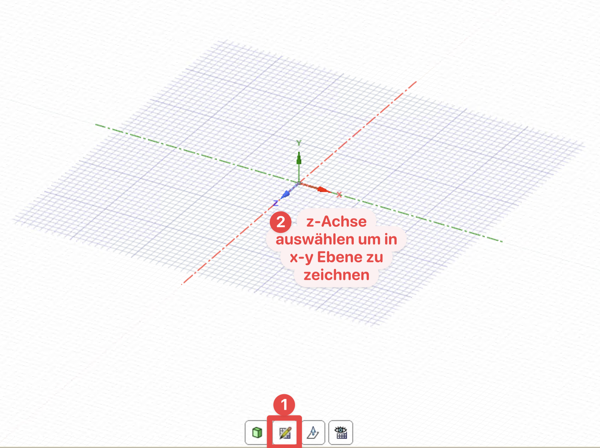
    
      Umsetzung
    
  </a>
  <a class="prakt-card" href="02_ESZ/Uebung01-2D/">
    
    
      Übung 1
      Zweiseitig gelagerter Balken mit Flächenlast
    
  </a>
  <a class="prakt-card" href="02_ESZ/Uebung02-2D/">
    
    
      Übung 2
      Kragarm mit Einzelkraft
    
  </a>

## 2D — Rotationssymmetrie

  <a class="prakt-card" href="03_Rotationssymmetrie/Rotationssymmetrie/">
    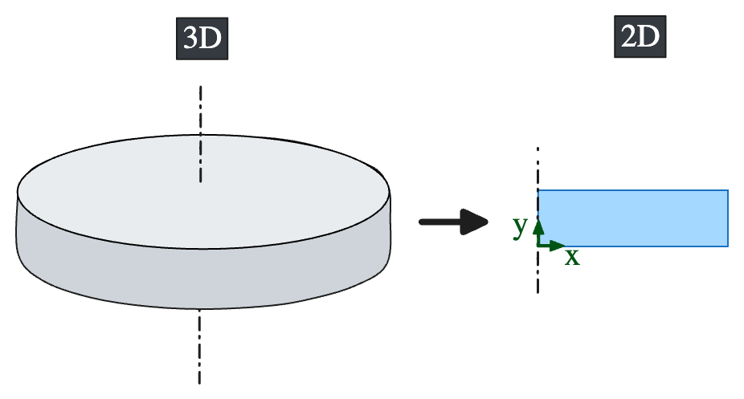
    
      2D Rotationssymmetrie
    
  </a>
  <a class="prakt-card" href="03_Rotationssymmetrie/Umsetzung/">
    
    
      Umsetzung
    
  </a>
  <a class="prakt-card" href="03_Rotationssymmetrie/Uebung03/">
    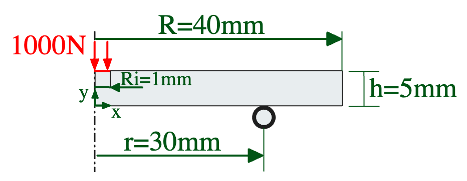
    
      Übung 3
      Kugel-Ring Versuch
    
  </a>

## Linienstrukturen (BEAM-Elemente)

  <a class="prakt-card" href="04_Linienstrukturen/Linienstrukturen/">
    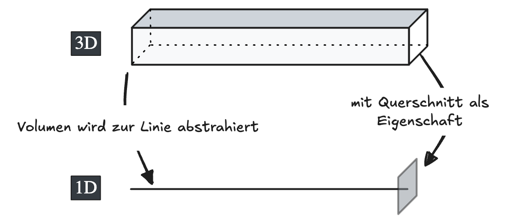
    
      1D Linienstrukturen (BEAM)
    
  </a>
  <a class="prakt-card" href="04_Linienstrukturen/Umsetzung/">
    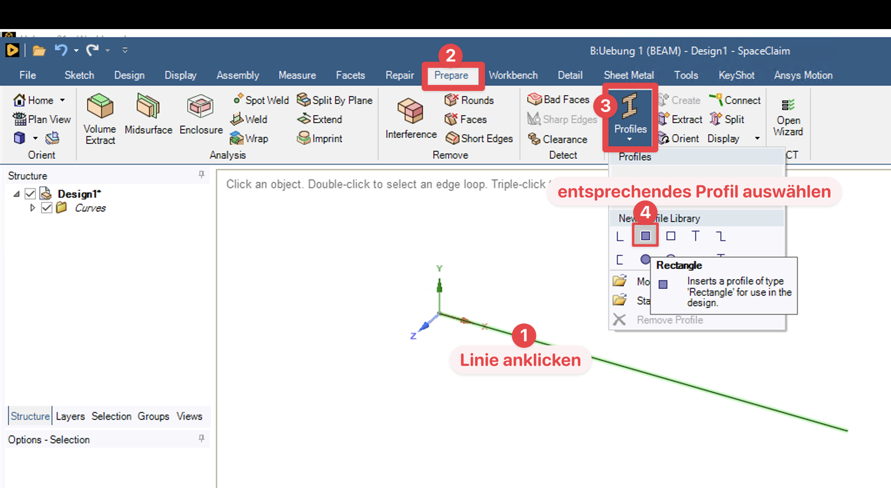
    
      Umsetzung
    
  </a>
  <a class="prakt-card" href="04_Linienstrukturen/Uebung01-BEAM/">
    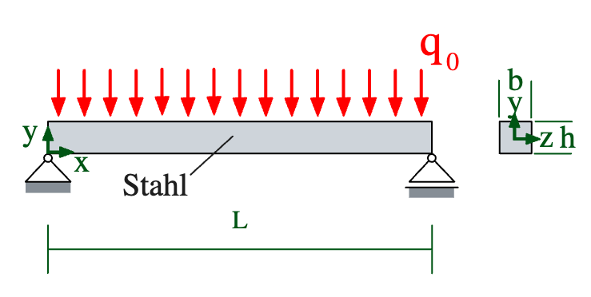
    
      Übung 1-BEAM
      Zweiseitig gelagerter Balken mit Flächenlast
    
  </a>

## Flächenstrukturen (SHELL-Elemente)

  <a class="prakt-card" href="05_Flaechenstrukturen/Flaechenstrukturen/">
    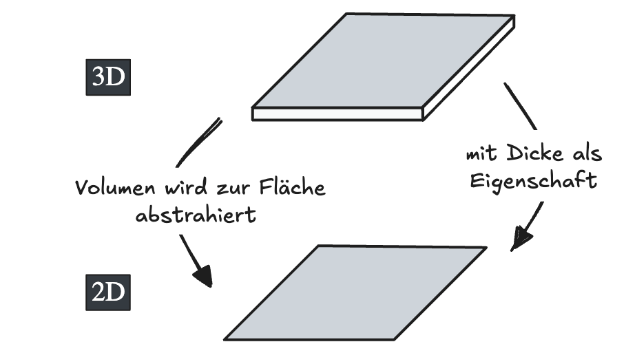
    
      2D Flächenstrukturen (SHELL)
    
  </a>
  <a class="prakt-card" href="05_Flaechenstrukturen/Umsetzung/">
    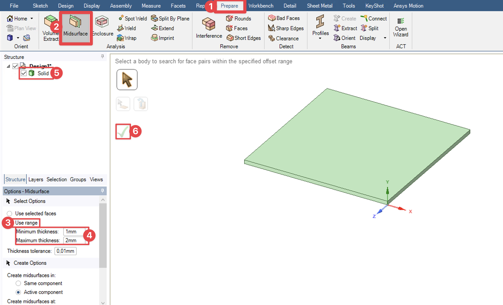
    
      Umsetzung
    
  </a>
  <a class="prakt-card" href="05_Flaechenstrukturen/Uebung04/">
    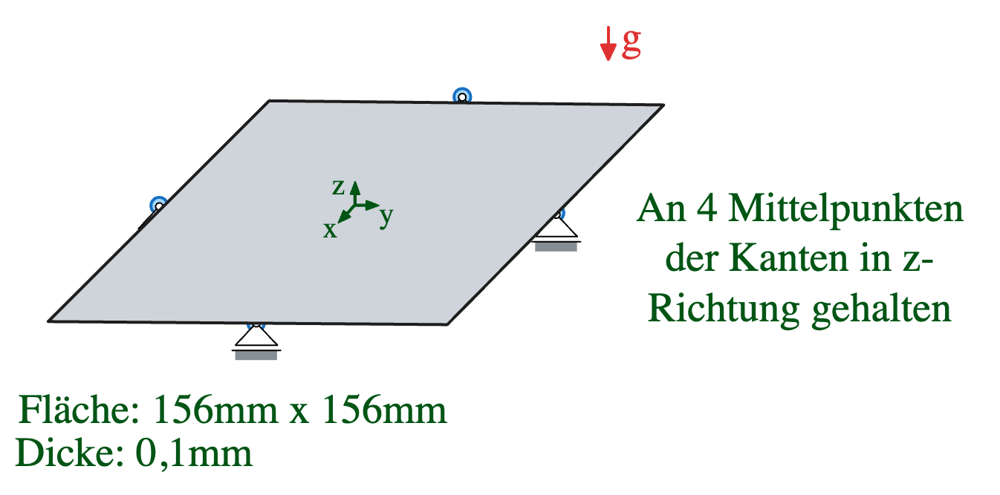
    
      Übung 4
      Durchbiegung von Photovoltaikwafern im Carrier
    
  </a>

