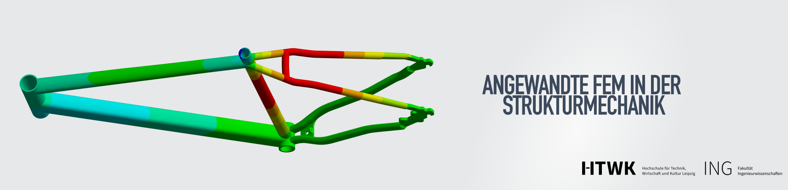
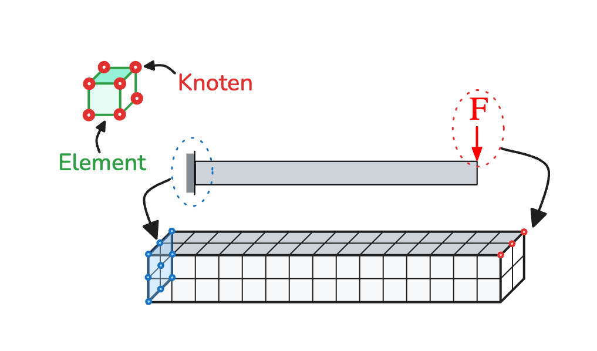

  { .no-lightbox data-glightbox="disabled" width="100%" loading=lazy }

-   <a class="card-link" href="P1_Einfuehrung/">
        __Praktikum 1 :material-rocket-launch: Einführung in ANSYS Workbench__{ .xxxl .middle .center }
        <figure style="text-align:center;">
          
        </figure>
    </a>

-   __Praktikum 2 :material-cube: Geometrieaufbereitung, Lagerung und Lasten__
     
     
    Work in Progress

-   __Praktikum 3 :material-cube-unfolded: Vernetzung__
     
     
    Work in Progress

-   __Praktikum 4 :material-video-2d: Abstraktion__
     
     
    Work in Progress

-   __Praktikum 5 :material-chart-box: Post Processing__
     
     
    Work in Progress

-   <a class="card-link" href="00_FAQ/">
    __:material-frequently-asked-questions: FAQ__
      Antworten auf häufig gestellte Fragen
    </a>

## Dozenten

-  <a class="card-link" href="https://bildungsportal.sachsen.de/opal/auth/RepositoryEntry/18448121873/CourseNode/1633401058120725004" target="_blank" rel="noopener noreferrer">
 
  **M.Eng. Felix Kaule**  
  Felix(dot)Kaule(at)htwk-leipzig.de
  </a>

- <a class="card-link" href="https://bildungsportal.sachsen.de/opal/auth/RepositoryEntry/18448121873/CourseNode/1760236690964595011" target="_blank" rel="noopener noreferrer"> 

  **M.Eng. Klaus Schneller**  
  Klaus(dot)Schneller(at)htwk-leipzig(.)de
  </a>

- <a class="card-link" href="https://bildungsportal.sachsen.de/opal/auth/RepositoryEntry/18448121873/CourseNode/98344428551217" target="_blank" rel="noopener noreferrer"> 

  **Prof. Dr.-Ing. Stephan Schönfelder**  
  Stephan(dot)Schoenfelder(at)htwk-leipzig.de
  </a>

