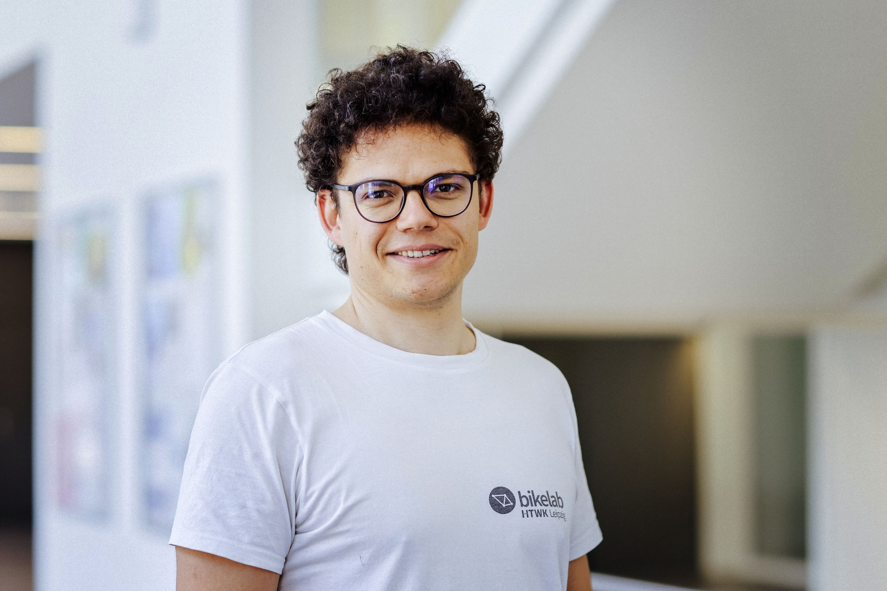

<section class="kurs-hero">
  

    
HTWK Leipzig · Fakultät Ingenieurwissenschaften

    <h1 class="kurs-hero-title">Angewandte FEM in der Strukturmechanik</h1>
    

      <a class="kurs-btn kurs-btn--primary" href="P1_Einfuehrung/">Mit Praktikum 1 starten →</a>
      <a class="kurs-btn" href="Fortschritt/">Mein Fortschritt</a>
    

    

      

        <svg viewBox="0 0 24 24"><path d="M10 17l5-5-5-5v3H3v4h7v3zm9 2h-6v2h6c1.1 0 2-.9 2-2V5c0-1.1-.9-2-2-2h-6v2h6v14z"/></svg>
        

          
Fortschritt mit OPAL sichern

          
Melden Sie sich über den OPAL-Kurs an: Dann werden Ihre Punkte gespeichert und auf jedem Gerät angezeigt, auf dem Sie angemeldet sind. Ohne Anmeldung bleibt Ihr Stand nur in diesem Browser.

          
<svg viewBox="0 0 24 24" aria-hidden="true"><path d="M7,6H17A6,6 0 0,1 23,12A6,6 0 0,1 17,18C15.22,18 13.63,17.23 12.53,16H11.47C10.37,17.23 8.78,18 7,18A6,6 0 0,1 1,12A6,6 0 0,1 7,6M6,9V11H4V13H6V15H8V13H10V11H8V9H6M15.5,12A1.5,1.5 0 0,0 14,13.5A1.5,1.5 0 0,0 15.5,15A1.5,1.5 0 0,0 17,13.5A1.5,1.5 0 0,0 15.5,12M18.5,9A1.5,1.5 0 0,0 17,10.5A1.5,1.5 0 0,0 18.5,12A1.5,1.5 0 0,0 20,10.5A1.5,1.5 0 0,0 18.5,9Z"/></svg><b>Minispiele:</b> Im Knackpunkt nehmen Sie Material weg, bis das Bauteil bricht, und spielen um die Bestenliste. Die Runde am Ende jedes Praktikums schalten Sie mit der Anmeldung frei.

          
Außerhalb des HTWK-Netzes muss dafür das VPN aktiv sein.

          <a class="kurs-opal-link" href="https://bildungsportal.sachsen.de/opal/auth/RepositoryEntry/18448121873/CourseNode/1784428828536783012">Über OPAL anmelden →</a>
        

      

      

        <svg viewBox="0 0 24 24"><path d="M9 16.2 4.8 12l-1.4 1.4L9 19 21 7l-1.4-1.4z"/></svg>
        

          
Über OPAL angemeldet

          
Ihre Punkte werden gespeichert und auf jedem Gerät angezeigt, auf dem Sie angemeldet sind. Ihre Plätze in den Knackpunkt-Bestenlisten finden Sie unter Mein Fortschritt.

          
Außerhalb des HTWK-Netzes muss für den Abgleich das VPN aktiv sein.

          <a class="kurs-opal-link" href="Fortschritt/">Mein Fortschritt →</a>
        

      

    

    
  

  

</section>

## Die Praktika

<!-- Daten der Praktika: extra.praktika in mkdocs.yml (auch für die Abschluss-Karte am Ende jedes Praktikums) -->


  <a class="prakt-row" href="{{ p.link }}">
    
      Praktikum {{ p.nr }}
      {{ p.titel }}
      {{ p.text }}
    
    
  </a>


<a class="home-faq" href="00_FAQ/">Fragen? Antworten auf die häufigsten gibt es im <strong>FAQ</strong> →</a>

## Dozenten

  <a class="doz-item" href="https://bildungsportal.sachsen.de/opal/auth/RepositoryEntry/18448121873/CourseNode/1633401058120725004" target="_blank" rel="noopener noreferrer">
    
    
      M.Eng. Felix Kaule
      Felix(dot)Kaule(at)htwk-leipzig.de
    
  </a>
  <a class="doz-item" href="https://bildungsportal.sachsen.de/opal/auth/RepositoryEntry/18448121873/CourseNode/1760236690964595011" target="_blank" rel="noopener noreferrer">
    
    
      M.Eng. Klaus Schneller
      Klaus(dot)Schneller(at)htwk-leipzig(.)de
    
  </a>
  <a class="doz-item" href="https://bildungsportal.sachsen.de/opal/auth/RepositoryEntry/18448121873/CourseNode/98344428551217" target="_blank" rel="noopener noreferrer">
    
    
      Prof. Dr.-Ing. Stephan Schönfelder
      Stephan(dot)Schoenfelder(at)htwk-leipzig.de
    
  </a>

